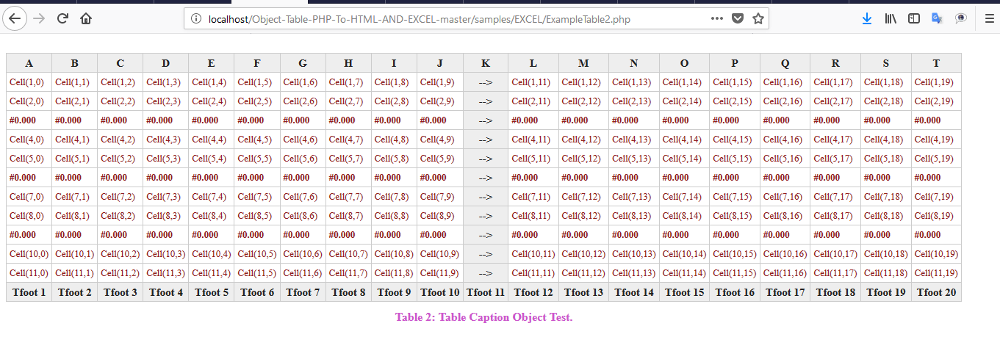

# Object Table PHP To HTML and EXCEL

Create tables objects to create HTML or Excel documents.

[PhpSpreadsheet 1.2](https://phpspreadsheet.readthedocs.io/en/develop/) is used to create Excel.

## Install

In order to install, composer is required.
* go to the root of the package; Write the command "composer install"

## Examples:

## Example 1:
## HTML:

## EXCEL:

## Example 2:
## HTML:

## EXCEL:

## Example 3:
## HTML:

## EXCEL:

## Example 4:
## HTML:

## EXCEL:

